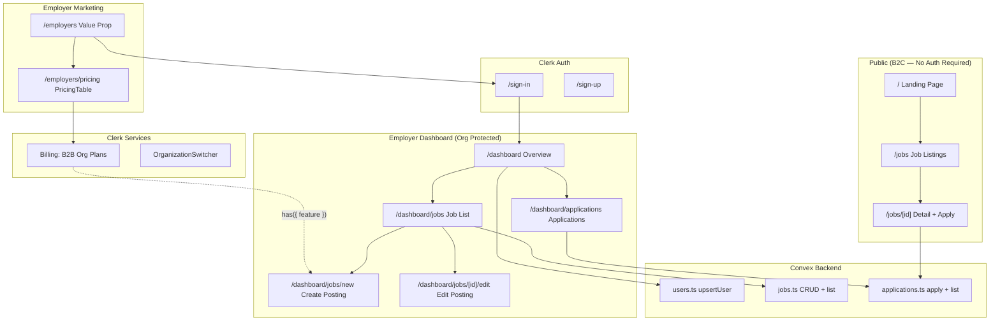

# Indeed-Style Job Board — Build Plan

## Architecture Overview



---

## Phase 1 — Auth Foundation

**Goal:** Get Clerk + Convex auth fully wired so the rest of the app can rely on `ctx.auth.getUserIdentity()` and `auth()` server-side.

### 1.1 Fix `convex/auth.config.ts`

Currently the Clerk provider is commented out. Uncomment and configure:

```ts
export default {
  providers: [
    {
      domain: process.env.CLERK_JWT_ISSUER_DOMAIN,
      applicationID: "convex",
    },
  ],
};
```

Add `CLERK_JWT_ISSUER_DOMAIN` (found in Clerk Dashboard → JWT Templates → Convex) to `.env.local`.

### 1.2 Create `middleware.ts`

Protect the entire `/dashboard` subtree. Public routes (`/`, `/jobs`, `/employers`, `/sign-in`, `/sign-up`) remain open.

```ts
import { clerkMiddleware, createRouteMatcher } from "@clerk/nextjs/server";

const isProtected = createRouteMatcher(["/dashboard(.*)"]);

export default clerkMiddleware(async (auth, req) => {
  if (isProtected(req)) await auth.protect();
});

export const config = { matcher: ["/((?!_next|.*\\..*).*)"] };
```

### 1.3 Sign-in / Sign-up pages

- `app/sign-in/[[...sign-in]]/page.tsx` — renders `<SignIn />` centered
- `app/sign-up/[[...sign-up]]/page.tsx` — renders `<SignUp />`
- Add `NEXT_PUBLIC_CLERK_SIGN_IN_URL=/sign-in` and `NEXT_PUBLIC_CLERK_SIGN_UP_URL=/sign-up` to `.env.local`

### 1.4 Clerk Dashboard manual steps (documented, not code)

- Enable **Organizations** in Clerk Dashboard → Organizations
- Enable **Billing** in Clerk Dashboard → Billing → connect Stripe dev gateway
- Create **Organization Plans** under Billing → Subscription plans → Plans for Organizations tab:
  - `free` — 0 $/mo — Feature: `job_postings` (limit: 1 active posting enforced in app code)
  - `starter` — 49 $/mo — Feature: `job_postings` (unlimited), `featured_listings`
  - `pro` — 99 $/mo — all of the above + `applicant_tracking`

---

## Phase 2 — Convex Backend

**Goal:** Replace the demo `numbers` schema with a real data model and write all backend functions.

### 2.1 Schema — `convex/schema.ts`

Four tables replacing the current `numbers` table:

```
users
  tokenIdentifier  string   (Clerk identity.tokenIdentifier)
  clerkUserId      string
  name             string
  email            string
  indexes: by_token (tokenIdentifier)

organizations
  clerkOrgId       string   (Clerk organization ID)
  name             string
  slug             string   (Clerk org slug)
  logoUrl          optional string
  plan             "free" | "starter" | "pro"
  memberCount      number   (denormalized counter, kept in sync via upsertOrg)
  createdAt        number   (_creationTime is auto-added, this is for Clerk creation date)
  indexes: by_clerk_org_id (clerkOrgId)

jobPostings
  orgId            Id<"organizations">  (FK to organizations table)
  clerkOrgId       string               (denormalized for fast index lookups without join)
  title            string
  description      string
  location         string
  locationType     "onsite" | "remote" | "hybrid"
  employmentType   "full-time" | "part-time" | "contract" | "internship"
  salaryMin        optional number
  salaryMax        optional number
  requirements     string   (markdown)
  status           "draft" | "active" | "closed"
  featured         boolean
  indexes: by_org (orgId), by_clerk_org_id (clerkOrgId), by_status (status), by_org_and_status (clerkOrgId, status)

applications
  jobPostingId     Id<"jobPostings">
  applicantName    string
  applicantEmail   string
  phone            optional string
  coverLetter      optional string
  resumeStorageId  optional Id<"_storage">
  status           "pending" | "reviewed" | "shortlisted" | "rejected" | "hired"
  indexes: by_job (jobPostingId), by_job_and_status (jobPostingId, status)
```

**Why a separate `organizations` table?**
- Stores a local cache of Clerk org metadata (name, logo, plan) so job listings can display company info without calling the Clerk API on every read
- The `plan` field is kept in sync from the JWT claim on each authenticated request via `upsertOrg` — acts as a fallback record and enables future server-side queries (e.g. "show all pro orgs")
- `jobPostings` holds both `orgId` (typed FK) and `clerkOrgId` (string) — the FK enables joins for company info display; the string is indexed for fast org-scoped queries from the JWT without a lookup step

### 2.2 `convex/users.ts`

- `upsertUser` (mutation) — called from `ConvexClientProvider` on auth change; idempotently creates/updates the user row from `ctx.auth.getUserIdentity()`

### 2.3 `convex/organizations.ts`

- `upsertOrg` (mutation, authenticated) — called whenever an employer lands in the dashboard; idempotently creates/updates the org row using org fields from the Clerk JWT (`identity.orgId`, `identity.orgSlug`, `identity.orgName`). Also syncs the `plan` field from the active plan claim in the token
- `getByClerkOrgId` (query, authenticated) — returns the org document for the caller's active org; used to display company info on the dashboard and to resolve `orgId` when creating job postings

### 2.4 `convex/jobs.ts`

- `listActive` (query, public) — paginated, filter by `status = "active"`, optional `search` string via search index, optional `locationType` / `employmentType` filters
- `getById` (query, public) — single job by `Id<"jobPostings">`
- `listByOrg` (query, authenticated) — returns org's own postings, all statuses; derives `clerkOrgId` from JWT org claim in `identity.tokenIdentifier`
- `create` (mutation, authenticated) — validates org membership; throws if org has no active `job_postings` feature entitlement (enforced via a passed `hasFeature` boolean from the client, with server-side verification approach described below)
- `update` (mutation, authenticated) — verifies the posting belongs to the caller's org
- `updateStatus` (mutation, authenticated) — change `draft → active`, `active → closed`, etc.

> **Note on plan enforcement in Convex:** Because Clerk billing plan data lives in the JWT (not Convex), the pattern is: the Next.js Server Action or route first calls `auth()` and checks `has({ feature: 'job_postings' })`, then calls the Convex mutation only if authorized. The Convex mutation independently verifies org ownership via `ctx.auth.getUserIdentity()`. This is the recommended split — Clerk handles entitlements, Convex handles data ownership.

### 2.5 `convex/applications.ts`

- `apply` (mutation, public — no auth required) — takes `jobPostingId` + applicant fields; checks that job exists and is `active`; optionally generates a Convex Storage upload URL for resume
- `getUploadUrl` (mutation, public) — returns a short-lived Convex Storage upload URL for resume PDF
- `listByJob` (query, authenticated) — verifies caller's org owns the job before returning applications
- `updateStatus` (mutation, authenticated) — employer updates application status; verifies org ownership

---

## Phase 3 — Public Job Seeker Experience

**Goal:** Build everything a job seeker interacts with — landing page, search/listings, and application form.

### 3.1 Global Shell

- **`app/layout.tsx`** — add `<NavBar />` at the top. NavBar shows: logo, "Find Jobs" link, "For Employers" link, and Clerk `<UserButton />` / Sign In button on the right
- **`components/NavBar.tsx`** — client component using `useAuth` to conditionally show dashboard link for logged-in org members

### 3.2 Landing Page — `app/page.tsx`

Sections (all Server Component, data fetched via `preloadQuery`):

- **Hero** — large headline ("Find Your Next Role"), search bar (keyword + location), "Search Jobs" button linking to `/jobs?q=...&location=...`
- **Stats strip** — e.g. "10,000+ jobs · 500+ companies · Free to apply"
- **Featured Jobs** — grid of up to 6 `JobCard` components from `listActive` with `featured: true`
- **Browse by Category** — static list of common job categories linking to filtered `/jobs` pages
- **Employer CTA** — "Hiring? Post a job in minutes" → `/employers`

### 3.3 Job Listings — `app/jobs/page.tsx`

- Server Component reading `searchParams` (`q`, `location`, `locationType`, `employmentType`, `page`)
- Uses Convex `preloadQuery(api.jobs.listActive, { ... })` for SSR
- `<JobCard />` — shows title, company (org name), location, type badge, salary range, posted date, "Apply" button
- Sidebar filters — location type, employment type (client-side filter state via URL params)
- Pagination using Convex cursor-based pagination

### 3.4 Job Detail + Apply — `app/jobs/[id]/page.tsx`

- Server Component — `preloadQuery(api.jobs.getById, { id })`
- Left column: full job description (rendered markdown), requirements, salary, location
- Right column (sticky): "Apply Now" card — expands into inline `<ApplicationForm />`
- **`components/ApplicationForm.tsx`** — client component:
  - Fields: Full Name, Email, Phone (optional), Cover Letter (textarea), Resume (file upload → `getUploadUrl` → Convex Storage)
  - On submit: calls `api.applications.apply` mutation
  - Shows success confirmation on completion

---

## Phase 4 — Employer Experience (Auth-gated)

**Goal:** Employer sign-up flow, org creation, pricing, and the full dashboard.

### 4.1 Employer Landing — `app/employers/page.tsx`

- Value proposition page: "Post jobs to thousands of candidates"
- Feature highlights: applicant tracking, team members, org-level billing
- Two CTAs: "Get Started Free" → `/sign-up`, "See Pricing" → `/employers/pricing`

### 4.2 Pricing Page — `app/employers/pricing/page.tsx`

Uses the official Clerk component:

```tsx
import { PricingTable } from "@clerk/nextjs";

export default function PricingPage() {
  return (
    <div>
      <h1>Simple, transparent pricing</h1>
      <PricingTable for="organization" />
    </div>
  );
}
```

`PricingTable` automatically reads the org plans created in the Clerk Dashboard and handles the Stripe checkout flow. No custom checkout code needed.

### 4.3 Dashboard Layout — `app/dashboard/layout.tsx`

- Server Component — calls `auth()`, redirects to `/sign-in` if not authenticated
- Also redirects to `/create-organization` (Clerk hosted page) if the user has no active org
- Renders a persistent sidebar with: Overview, Jobs, Applications, Settings
- Sidebar footer includes `<OrganizationSwitcher />` from `@clerk/nextjs` so multi-org employers can switch context
- Plan badge next to org name (free / starter / pro), derived from `auth().has({ plan: ... })`

### 4.4 Dashboard Overview — `app/dashboard/page.tsx`

- Stats cards: Active Postings count, Total Applications, New Applications (last 7 days), Hired count
- Recent Applications table (last 5)
- Quick-action button: "Post a New Job" (shown only if `has({ feature: 'job_postings' })`)

### 4.5 Job Management — `app/dashboard/jobs/page.tsx`

- Lists all org's job postings from `api.jobs.listByOrg`
- Table columns: Title, Status badge (draft/active/closed), Applications count, Created date, Actions (Edit, Close, Delete)
- "New Job Posting" button in header

**Plan gate on job creation:**

```tsx
// app/dashboard/jobs/new/page.tsx  (Server Component)
import { auth } from "@clerk/nextjs/server";

export default async function NewJobPage() {
  const { has } = await auth();
  const canPost = has({ feature: "job_postings" });

  if (!canPost) {
    return <UpgradePrompt />;  // shows pricing CTA
  }
  return <JobForm />;
}
```

- `<JobForm />` — client component with fields: Title, Description (rich text), Location, Location Type, Employment Type, Salary Min/Max, Requirements, Status (draft/active)

### 4.6 Applications Viewer — `app/dashboard/applications/page.tsx`

- Query param `?jobId=...` to filter by specific posting, or show all
- Table: Applicant name, email, job applied to, date, status dropdown (employer can change status inline)
- Click row → slide-out panel with full application details (cover letter, resume download link)

---

## Phase 5 — Billing Management & Polish

**Goal:** Surface billing state throughout the UI and add upgrade prompts.

### 5.1 Billing Management in Dashboard Settings

- `app/dashboard/settings/page.tsx` — shows current plan, next billing date, link to Clerk's hosted billing portal (available via `<ManageSubscriptionButton />` or redirect to Clerk's org billing URL)

### 5.2 Upgrade Prompts

- `components/UpgradePrompt.tsx` — reusable banner/card shown when a feature is locked; links to `/employers/pricing`
- Show inline in: "New Job Posting" page when on free plan and already at limit, "Featured listing" toggle in JobForm when `starter` plan not active, "Applicant Tracking" section when `applicant_tracking` feature missing

### 5.3 `<Show />` Component Usage

Use Clerk's `<Show />` component for lightweight client-side gating in dashboard UI:

```tsx
import { Show } from "@clerk/nextjs";

<Show
  when={{ feature: "featured_listings" }}
  fallback={<UpgradePrompt feature="Featured Listings" />}
>
  <FeaturedToggle />
</Show>
```

---

## Dependency Notes

No new `npm` packages needed — `@clerk/nextjs` already includes `PricingTable`, `Show`, `OrganizationSwitcher`, and all billing hooks. Convex is already installed.

`.env.local` variables needed:
- `NEXT_PUBLIC_CONVEX_URL` (already set)
- `NEXT_PUBLIC_CLERK_PUBLISHABLE_KEY` (already set)
- `CLERK_SECRET_KEY` (already set)
- `CLERK_JWT_ISSUER_DOMAIN` — **new**, from Clerk Dashboard → JWT Templates → Convex template → Issuer

---

## File Inventory

**New files:**
- `middleware.ts`
- `convex/users.ts`, `convex/organizations.ts`, `convex/jobs.ts`, `convex/applications.ts`
- `app/sign-in/[[...sign-in]]/page.tsx`
- `app/sign-up/[[...sign-up]]/page.tsx`
- `app/jobs/page.tsx`, `app/jobs/[id]/page.tsx`
- `app/employers/page.tsx`, `app/employers/pricing/page.tsx`
- `app/dashboard/layout.tsx`, `app/dashboard/page.tsx`
- `app/dashboard/jobs/page.tsx`, `app/dashboard/jobs/new/page.tsx`
- `app/dashboard/jobs/[id]/edit/page.tsx`
- `app/dashboard/applications/page.tsx`
- `app/dashboard/settings/page.tsx`
- `components/NavBar.tsx`, `components/JobCard.tsx`
- `components/ApplicationForm.tsx`, `components/JobForm.tsx`
- `components/UpgradePrompt.tsx`

**Modified files:**
- `convex/schema.ts` — full schema (remove `numbers`, add 3 tables)
- `convex/auth.config.ts` — uncomment and configure Clerk JWT provider
- `app/layout.tsx` — wrap with NavBar
- `app/page.tsx` — replace demo content with landing page
- `convex/myFunctions.ts` — delete (demo file, no longer needed)
